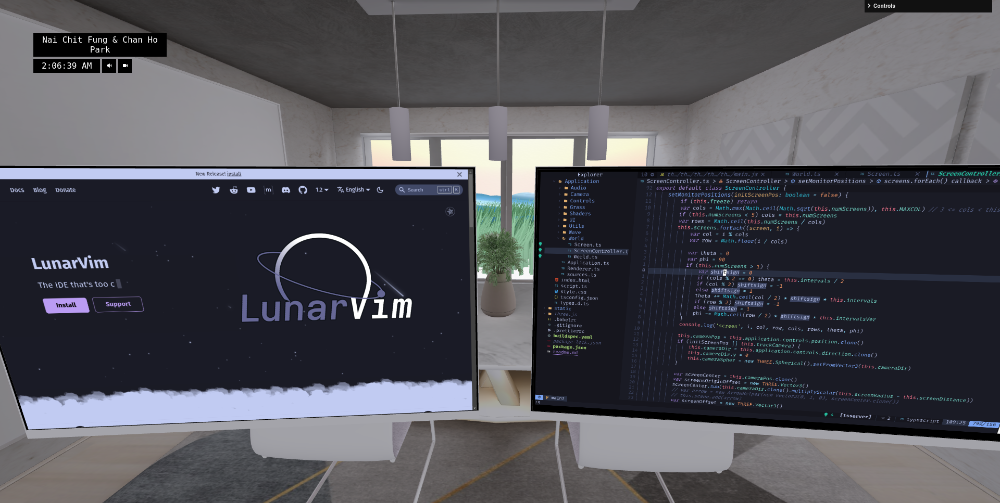

# Virtual Coding Room

This project is a course project of Advanced Computer Graphics (although you may argue it's more like a game) and aims to provide a proof-of-concepts of creating virtual coding environment that is both cozy and realistic to stay in, so you can touch grass without actually touch grass!



## Library Used

This coding project uses [@henryjeff](https://github.com/henryjeff/) [portfolio site](https://github.com/henryjeff/portfolio-website) as the base template. It has some of the basic utilities that is extremely useful to make this project works. Like making webpack to exports models correctly.

The libraries used in this project includes but probably not limited to:
- three.js (to provide the ability to create 3D graphics imagery)
- lil-gui (nifty gui for controlling attributes in JavaScript)

## Functions

- Virtual environment that like (sort of) pretty and attractive. But imagination is yours, add your own elements or even build your own environment! The key elements of our environments includes,
    - a room,
    - sky (Rayleigh scattering simulation),
    - raining (looks more like snowing though) and clouds,
    - animated grass and river,
- Monitors! Who doesn't want more monitors? We're always limited by space and money. In this project, monitors can be added to the scene on demand and can render websites on top. The websites you can go to will be:
    - [Google](https://www.google.com/webhp?igu=1)
    - Terminals! With the imaginary help from [cs01](https://github.com/Jacfger/pyxtermjs) to use [Xterm.js](https://xtermjs.org/) I was able to echo local terminal to websites. With some tweaking it's possible to do multiple instances of terminal at the same time. Definitely can run [Neovim](https://github.com/neovim) smoothly (as long as your GPU can take it).
    - [:3](https://www.youtube.com/embed/f2nhDhXuP9M?controls=0&autoplay=1&rel=0)

## Limitation

There're a lot of problems that we encountered when we're trying put everything together.
- The rain looks ass :DD, it's more like snow then rain.
- Resource heavy. It's quite slow especially when I'm trying to run it on laptop and have multiple instances of monitors.
- Evil X-Frame-Options. You can learn more about the details [here](https://github.com/niutech/x-frame-bypass). There're actually a lot of sites banned embedding their sites in others' site.

## Future ToDos, or the Next Step(s)

- Definitely looking forward to fix the rain effects, a better weather simulation in general. I also saw some work which render nice rain drop effects on the windows.
- Moving to other platforms like OpenGL or native platforms. Using iframe to embed is extremely limiting. Unfortunately this limitation is not going to go away as long as we're stuck using a browser for all this.
- Better controls. Right now the control is nice, but definitely could be a bit clunky for something that you would like to daily drive it. I'm looking forward to add all keyboard controls like what PopOS did.
- Animations. In the original repository, Henry used TWEEN.js for animations. Adding some animation can definitely be a nice touch and make it more appealing.

## 3D Models Used
- [Monitors](https://sketchfab.com/3d-models/monitor-c6a27922749448cb9e04442c32e49fd6) with the stand removed by myself.
- [The Room](https://sketchfab.com/3d-models/modern-dining-room-df3f3c9f6233447eb8b7ee129f3bace5).

To setup a dev environment:
```bash
# Clone the repository

# Install dependencies 
npm i

# Run the local dev server
npm run dev
```

## Authors
[@jacfger] (https://github.com/jacfger)

[@ch-ho00] (https://github.com/ch-ho00)

